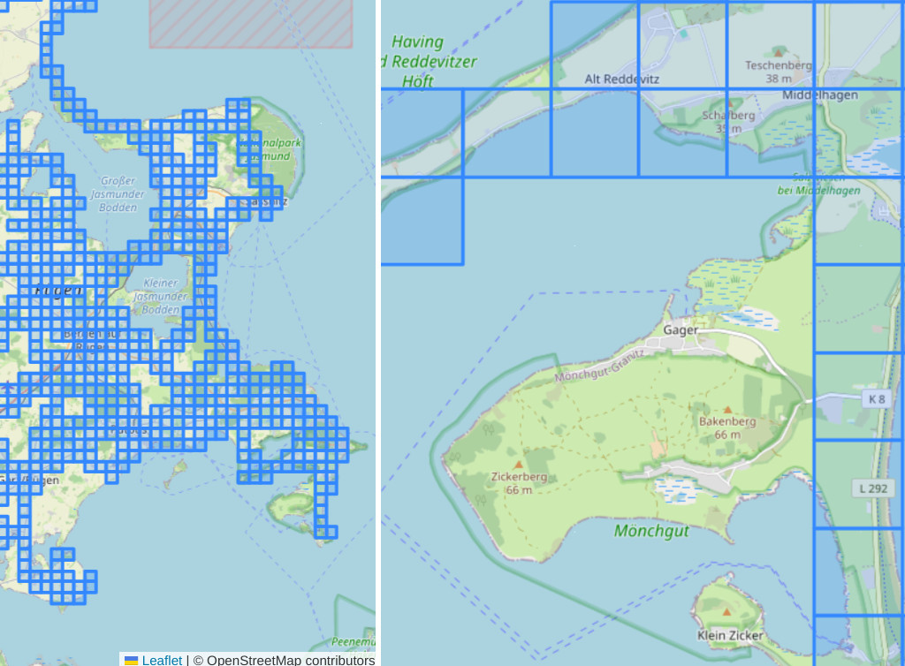

# GPX Tile Hunt - Identify undiscovered areas more easily


  
_Fig: Tile mesh at different zoom levels_

- Why: Statshunters.com supposedly allows registration without Strava, but currently, 
	I only see options to log in via email or Strava, with no actual sign-up options.  
	So, I built something of my own.
- Usage:
	```sh
		$ ./setup.sh     # installs python-libs etc to the project's subdir 'local', so your system stays clean
		$                # requires Linux, Python 3 with pip
		$ ./gpx2kml.py   # Generates tile mesh KML file from ./routes/*.gpx
		$ ./kml2htm.py   # Generates a local tile mesh viewer from KML file and OpenStreetMap
	```
- Input:
	- Komoot: [download GPX routes](https://github.com/pieterclaerhout/export-komoot) to the `routes` directory
- Viewers:
	- Web-browser and local HTML file generated by kml2htm.py
	- [Google My Maps](https://www.google.com/maps/d/): create a map, create new layer, import generated KML-file


## See Also

- my stared cycling tools on GitHub: https://github.com/stars/andre-st/lists/cycling

